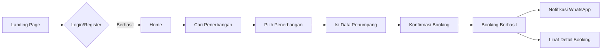
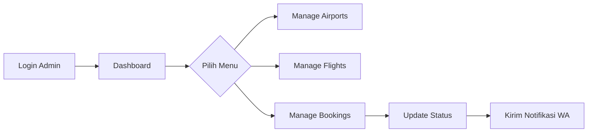

# ✈️ Tiketku - Sistem Pemesanan Tiket Pesawat

<div align="center">


**Platform pemesanan tiket pesawat modern dengan notifikasi WhatsApp real-time** 🚀

[Demo](#) • [Dokumentasi](#-dokumentasi-teknis) • [Panduan User](#-panduan-pengguna)

</div>

---

## 📋 Daftar Isi

- [✨ Fitur Utama](#-fitur-utama)
- [🎯 Tech Stack](#-tech-stack)
- [⚙️ Requirements](#️-requirements)
- [🚀 Instalasi](#-instalasi)
- [📚 Dokumentasi Teknis](#-dokumentasi-teknis)
- [👤 Panduan Pengguna](#-panduan-pengguna)
- [🔐 Akses Login](#-akses-login)
- [📸 Screenshots](#-screenshots)
- [🤝 Kontribusi](#-kontribusi)
- [📝 License](#-license)

---

## ✨ Fitur Utama

### 🎨 **User Interface Modern**
- 🌈 Design Gen Z dengan warna vibrant dan animasi smooth
- 📱 Fully responsive (Mobile, Tablet, Desktop)
- 🎭 Glassmorphism & gradient effects
- ⚡ Fast loading dengan Vite
- 🌙 Micro-interactions yang engaging

### 🎫 **Sistem Booking**
- ✈️ Pencarian penerbangan (Sekali Jalan, Pulang Pergi, Multi-Kota)
- 🔍 Filter berdasarkan bandara, tanggal, dan kelas
- 💳 Booking dengan kode unik otomatis
- 📊 Status tracking (Pending, Confirmed, Cancelled)

### 💬 **Notifikasi WhatsApp Real-time**
- 🔔 Notifikasi otomatis saat booking berhasil
- 📲 Update status booking via WhatsApp
- 🔌 Integrasi API Fonnte
- 📝 Log notifikasi lengkap di database

### 👨‍💼 **Admin Dashboard**
- 📈 Dashboard dengan statistik real-time
- 🛫 Manage Airports (CRUD)
- ✈️ Manage Flights (CRUD)
- 📋 Manage Bookings & Update Status
- 📱 Responsive sidebar dengan hamburger menu

### 🔐 **Authentication & Authorization**
- 🔑 Login & Register dengan validasi lengkap
- 👤 Profile management
- 🛡️ Role-based access (Admin & User)
- ⚙️ Settings page (Update profil & ganti password)

---

## 🎯 Tech Stack

| Layer | Technology |
|-------|-----------|
| **Backend** |  PHP 8.2+ |
| **Frontend** |   |
| **Build Tool** |  |
| **Database** |  |
| **Integration** |  (Fonnte) |

---

## ⚙️ Requirements

Pastikan sistem kamu sudah memenuhi requirement berikut:

- 🐘 **PHP** >= 8.2
- 🎵 **Composer** >= 2.x
- 🟢 **Node.js** >= 18.x & **NPM** >= 9.x
- 🗄️ **MySQL** >= 8.0
- 🔧 **Git**
- 📦 **Laragon** / **XAMPP** / **MAMP** (untuk local development)

---

## 🚀 Instalasi

### 1️⃣ Clone Repository

```bash
git clone https://github.com/hafisc/pemesanan-tiket.git
cd pemesanan-tiket
```

### 2️⃣ Install Dependencies

```bash
# Install PHP dependencies
composer install

# Install NPM dependencies
npm install
```

### 3️⃣ Setup Environment

```bash
# Copy .env.example ke .env
cp .env.example .env

# Generate application key
php artisan key:generate
```

### 4️⃣ Konfigurasi Database

Buka file `.env` dan sesuaikan dengan database kamu:

```env
DB_CONNECTION=mysql
DB_HOST=127.0.0.1
DB_PORT=3306
DB_DATABASE=pemesanan_tiket
DB_USERNAME=root
DB_PASSWORD=
```

### 5️⃣ Konfigurasi WhatsApp (Opsional)

Untuk mengaktifkan notifikasi WhatsApp real-time, daftarkan akun di [Fonnte.com](https://www.fonnte.com/) dan masukkan token:

```env
WHATSAPP_API_URL=https://api.fonnte.com/send
WHATSAPP_API_TOKEN=your_fonnte_token_here
```

> ⚠️ **Note**: Jika token kosong, sistem akan tetap berjalan dan mencatat log notifikasi ke database tanpa mengirim ke WhatsApp.

### 6️⃣ Migrate & Seed Database

```bash
# Jalankan migrations dan seeders
php artisan migrate:fresh --seed
```

Perintah ini akan:
- 🗄️ Membuat semua tabel database
- 👤 Membuat akun admin dan sample users
- 🛫 Membuat data bandara Indonesia & internasional
- ✈️ Membuat sample penerbangan

### 7️⃣ Build Assets & Run Server

```bash
# Terminal 1: Build frontend assets
npm run dev

# Terminal 2: Run Laravel server
php artisan serve
```

### 8️⃣ Akses Aplikasi

Buka browser dan akses:
- 🏠 **Landing Page**: http://localhost:8000
- 🔐 **Login**: http://localhost:8000/login
- 👨‍💼 **Admin Dashboard**: http://localhost:8000/admin

---

## 📚 Dokumentasi Teknis

### 📁 Struktur Project

```
pemesanan-tiket/
├── app/
│   ├── Http/
│   │   ├── Controllers/
│   │   │   ├── AuthController.php          # Handle login, register, logout
│   │   │   ├── FlightController.php        # Pencarian & detail penerbangan
│   │   │   ├── BookingController.php       # Proses booking tiket
│   │   │   ├── SettingsController.php      # Update profil & password
│   │   │   └── Admin/
│   │   │       ├── DashboardController.php # Dashboard & statistik
│   │   │       ├── AirportController.php   # CRUD bandara
│   │   │       ├── FlightController.php    # CRUD penerbangan
│   │   │       └── BookingController.php   # Manage semua booking
│   │   └── Middleware/
│   │       └── IsAdmin.php                 # Middleware cek role admin
│   ├── Models/
│   │   ├── User.php                        # Model user dengan role
│   │   ├── Airport.php                     # Model bandara
│   │   ├── Flight.php                      # Model penerbangan
│   │   ├── Booking.php                     # Model booking tiket
│   │   └── Notification.php                # Log notifikasi WhatsApp
│   └── Services/
│       └── WhatsAppService.php             # Handle kirim WhatsApp via Fonnte
├── database/
│   ├── migrations/                         # Semua migration files
│   └── seeders/
│       ├── AdminSeeder.php                 # Seed admin & users
│       ├── AirportSeeder.php               # Seed data bandara
│       └── FlightSeeder.php                # Seed data penerbangan
├── resources/
│   └── views/
│       ├── pages/
│       │   ├── home.blade.php              # Landing page
│       │   ├── settings/                   # Halaman pengaturan
│       │   ├── flights/                    # List & detail penerbangan
│       │   └── bookings/                   # List & detail booking user
│       ├── auth/                           # Halaman login, register, forgot password
│       ├── admin/                          # Semua view admin dashboard
│       └── layouts/
│           ├── app.blade.php               # Layout utama (user)
│           └── admin.blade.php             # Layout admin dashboard
└── routes/
    └── web.php                              # Semua route definitions
```

### 🔄 Flow Aplikasi

#### 📌 User Flow



#### 🔧 Admin Flow



### 🗄️ Database Schema

#### 👤 **users**
```sql
- id
- name
- email
- phone
- password
- role (admin/user)
- created_at, updated_at
```

#### 🛫 **airports**
```sql
- id
- code (e.g. CGK, DPS)
- name
- city
- country
- created_at, updated_at
```

#### ✈️ **flights**
```sql
- id
- flight_number
- airline
- departure_airport_id (FK: airports)
- arrival_airport_id (FK: airports)
- departure_time
- arrival_time
- class (Economy/Business/First Class)
- price
- available_seats
- status (active/inactive)
- created_at, updated_at
```

#### 📋 **bookings**
```sql
- id
- user_id (FK: users)
- flight_id (FK: flights)
- booking_code (auto-generated)
- passenger_name
- passenger_email
- passenger_phone
- seat_count
- total_price
- status (pending/confirmed/cancelled)
- created_at, updated_at
```

#### 📲 **notifications**
```sql
- id
- booking_id (FK: bookings, nullable)
- to_phone
- message
- status (pending/sent/failed)
- sent_at
- response_payload
- created_at, updated_at
```

### 🔐 Authentication Flow

1. **Register**:
   - Validasi input (name, email, phone, password)
   - Hash password dengan bcrypt
   - Set role default = 'user'
   - Redirect ke login dengan success message

2. **Login**:
   - Validasi credentials
   - Check role user:
     - Admin → redirect ke `/admin`
     - User → redirect ke `/`

3. **Logout**:
   - Invalidate session
   - Regenerate CSRF token
   - Redirect ke home

### 💬 WhatsApp Integration

#### Setup Fonnte API

1. Daftar di [Fonnte.com](https://www.fonnte.com/)
2. Dapatkan API token
3. Masukkan ke `.env`:
   ```env
   WHATSAPP_API_TOKEN=your_token_here
   ```

#### Flow Notifikasi

```php
// Saat booking dibuat
WhatsAppService->sendBookingCreated($booking)

// Saat status booking diupdate
WhatsAppService->sendBookingStatusUpdated($booking)
```

#### Format Pesan

**Booking Created**:
```
Halo {nama}, pesanan tiket Anda dengan kode {booking_code} berhasil dibuat. 
Status: {status}. Total: Rp {total_price}
```

**Status Updated**:
```
Halo {nama}, status pesanan {booking_code} telah diperbarui menjadi: {status}.
```

---

## 👤 Panduan Pengguna

### 🎫 Cara Memesan Tiket

1. **Buka Landing Page**
   - Kunjungi http://localhost:8000
   - Lihat hero section dengan form pencarian

2. **Cari Penerbangan**
   - Pilih tipe perjalanan (Sekali Jalan / Pulang Pergi / Multi-kota)
   - Pilih bandara asal dan tujuan
   - Pilih tanggal keberangkatan
   - Pilih kelas (Economy / Business / First Class)
   - Klik "Cari Tiket"

3. **Pilih Penerbangan**
   - Lihat list penerbangan yang tersedia
   - Klik "Pesan" pada penerbangan yang diinginkan

4. **Isi Data Penumpang**
   - Masukkan nama penumpang
   - Masukkan email
   - Masukkan nomor telepon (format: 08xxx atau 628xxx)
   - Pilih jumlah kursi
   - Klik "Konfirmasi Booking"

5. **Booking Berhasil**
   - Dapatkan kode booking unik
   - Terima notifikasi WhatsApp (jika API aktif)
   - Lihat detail booking di menu "Pesanan Saya"

### ⚙️ Cara Mengatur Profil

1. **Login** terlebih dahulu
2. Klik **avatar/nama kamu** di navbar
3. Pilih **"Pengaturan"**
4. Kamu bisa:
   - ✏️ Update nama, email, no. telepon
   - 🔒 Ganti password
   - 📊 Lihat info akun

### 📋 Cara Melihat Pesanan

1. Login ke akun
2. Klik **"Pesanan Saya"** di navbar
3. Lihat semua booking kamu dengan status:
   - ⏳ **Pending**: Menunggu konfirmasi
   - ✅ **Confirmed**: Sudah dikonfirmasi
   - ❌ **Cancelled**: Dibatalkan

---

## 👨‍💼 Panduan Admin

### 📊 Dashboard

- Lihat statistik total users, airports, flights, dan bookings
- Lihat recent bookings dengan quick actions

### 🛫 Manage Airports

1. Klik **"Bandara"** di sidebar
2. Klik **"Tambah Bandara"** untuk create new
3. Isi form (Code, Nama, Kota, Negara)
4. Klik **"Simpan"**

### ✈️ Manage Flights

1. Klik **"Penerbangan"** di sidebar
2. Klik **"Tambah Penerbangan"**
3. Isi semua data:
   - Nomor penerbangan
   - Maskapai
   - Bandara keberangkatan & tujuan
   - Waktu keberangkatan & kedatangan
   - Kelas & harga
   - Jumlah kursi tersedia
4. Klik **"Simpan"**

### 📋 Manage Bookings

1. Klik **"Booking"** di sidebar
2. Lihat semua booking dari semua user
3. Filter berdasarkan status
4. Klik **"Lihat Detail"** untuk melihat info lengkap
5. Update status booking:
   - Klik dropdown status
   - Pilih status baru (Pending/Confirmed/Cancelled)
   - Klik **"Update Status"**
   - Notifikasi WhatsApp otomatis terkirim ke penumpang

---

## 🔐 Akses Login

### 👤 Akun Default

Setelah menjalankan seeder, kamu bisa login dengan akun berikut:

#### Admin
```
Email: admin@tiketku.com
Password: password
```

#### Regular User
Buat akun baru melalui halaman Register atau gunakan akun yang dibuat seeder.

> 💡 **Tips**: Ganti password default setelah login pertama kali untuk keamanan!

---

## 📸 Screenshots

<details>
<summary>🏠 Landing Page</summary>

- Hero section dengan form pencarian
- Section keunggulan
- Promo spesial
- Rute populer
- Testimoni pelanggan
- CTA akhir

</details>

<details>
<summary>🔐 Authentication</summary>

- Halaman Login
- Halaman Register
- Halaman Forgot Password
- Profile Dropdown di Navbar

</details>

<details>
<summary>✈️ Flights & Booking</summary>

- List penerbangan dengan filter
- Detail penerbangan
- Form booking
- List booking user
- Detail booking

</details>

<details>
<summary>👨‍💼 Admin Dashboard</summary>

- Dashboard statistik
- CRUD Airports
- CRUD Flights
- Manage Bookings
- Responsive sidebar mobile

</details>

---

## 🤝 Kontribusi

Kontribusi sangat welcome! Untuk berkontribusi:

1. 🍴 Fork repository ini
2. 🌿 Buat branch baru (`git checkout -b feature/AmazingFeature`)
3. ✍️ Commit perubahan (`git commit -m 'Add some AmazingFeature'`)
4. 📤 Push ke branch (`git push origin feature/AmazingFeature`)
5. 🔃 Buat Pull Request

---

## 📝 License

This project is licensed under the MIT License - see the [LICENSE](LICENSE) file for details.

---

## 🙏 Acknowledgments

- 🎨 Design inspiration dari modern travel booking platforms
- 💬 WhatsApp integration powered by [Fonnte](https://www.fonnte.com/)
- 🚀 Built with [Laravel](https://laravel.com/), [Tailwind CSS](https://tailwindcss.com/), dan [Vite](https://vitejs.dev/)

---

